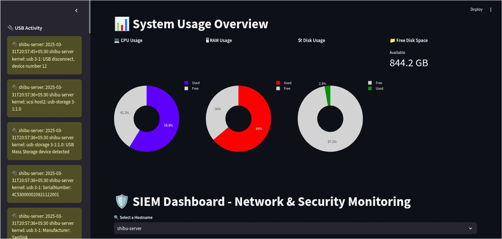
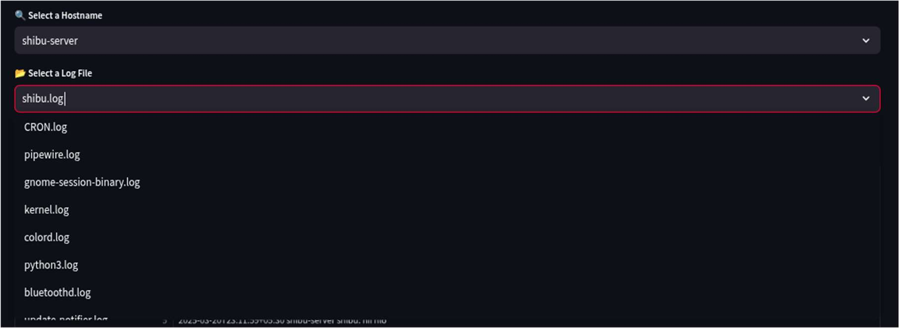
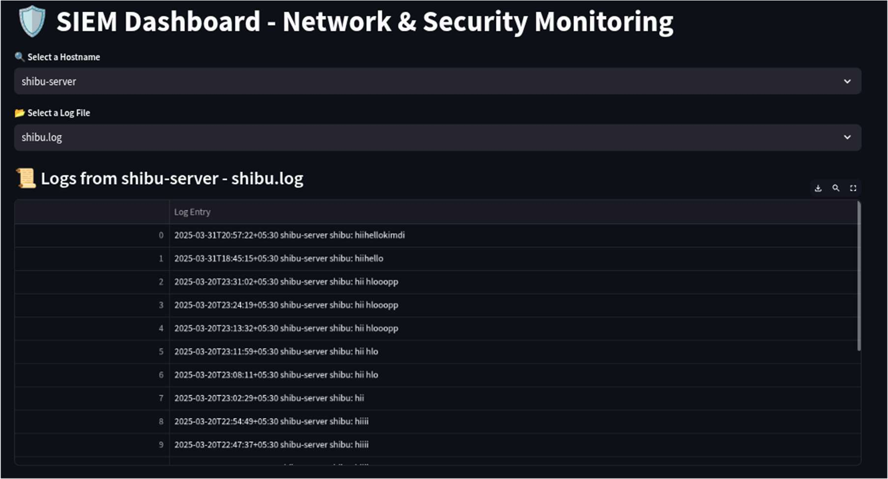
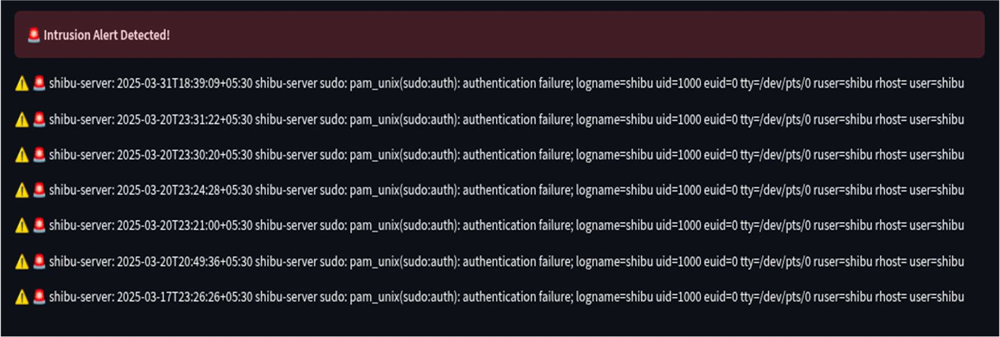

# 🛡️ SIEM Dashboard - Streamlit

A real-time, lightweight Security Information and Event Management (SIEM) dashboard built using Python and Streamlit.

It visualizes system usage, monitors client logs, and detects potential USB-based threats and intrusion attempts from logs like `auth.log`, `kernel.log`, etc.

---

## 📊 Features

- Real-time system monitoring (CPU, RAM, Disk)
- USB device detection from kernel logs
- Intrusion detection using predefined attack patterns
- Multi-host log monitoring
- Dynamic and interactive UI with Plotly charts
- Streamlit-based minimal and clean layout

---

## ⚙️ System Configuration Guide

### 🖥️ Server Configuration (SIEM Dashboard Host)

1. **Enable `rsyslog` to receive logs:**

  ```bash
   sudo systemctl enable rsyslog
   ```
2. **Configure rsyslog to receive logs:**

   Open `/etc/rsyslog.conf` and ensure the following lines are uncommented:

   ```conf
   module(load="imudp")
   input(type="imudp" port="514")

   module(load="imtcp")
   input(type="imtcp" port="514")
   ```

3. **Create log directory for incoming logs:**

   ```bash
   sudo mkdir -p /var/log/remote_logs
   sudo chmod -R 777 /var/log/remote_logs
   ```

4. **Configure template and storage for remote logs:**

   Add the following to the **end** of `/etc/rsyslog.conf`:

   ```conf
   template(name="RemoteLogs" type="string"
     string="/var/log/remote_logs/%HOSTNAME%/%PROGRAMNAME%.log")

   *.* ?RemoteLogs
   ```

5. **Restart `rsyslog`:**

   ```bash
   sudo systemctl restart rsyslog
   ```

### 💻 Client Configuration (Remote Monitored Systems)

1. **Edit the rsyslog config to forward selected logs:**

   Open `/etc/rsyslog.conf` and add the following to the bottom:

   ```conf
   *.* @@<SIEM_SERVER_IP>:514
   ```

   > 🔁 Replace `<SIEM_SERVER_IP>` with the actual IP address of your SIEM Dashboard host.

2. **Optional (Restrict to only needed logs like kernel, auth, sudo):**

   Instead of `*.*`, use:

   ```conf
   if $programname == 'kernel' or $programname == 'sudo' or $programname == 'CRON' or $programname == 'auth' then @@<SIEM_SERVER_IP>:514
   ```

3. **Restart `rsyslog` on the client:**

   ```bash
   sudo systemctl restart rsyslog
   ```

### 🔐 Permissions & Access

Ensure that the user running the Streamlit app has read access to `/var/log/remote_logs/`:

```bash
sudo chmod -R 755 /var/log/remote_logs
```
---

## Installation

```bash
git clone https://gitlab.com/yourusername/siem-dashboard-streamlit.git
cd siem-dashboard-streamlit
pip install -r requirements.txt
streamlit run siem_dashboard.py" 
``` 

---

## 📸 Screenshots
> The dashboard shows system resource usage, USB activity, and intrusion alerts in real time.


> The drop down menu to select the client systems and log files


> Display log entries retrieved from the selected client and log file


> Intrusion Detection Alert in SIEM Dashboard

