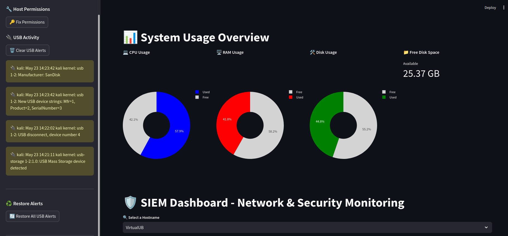
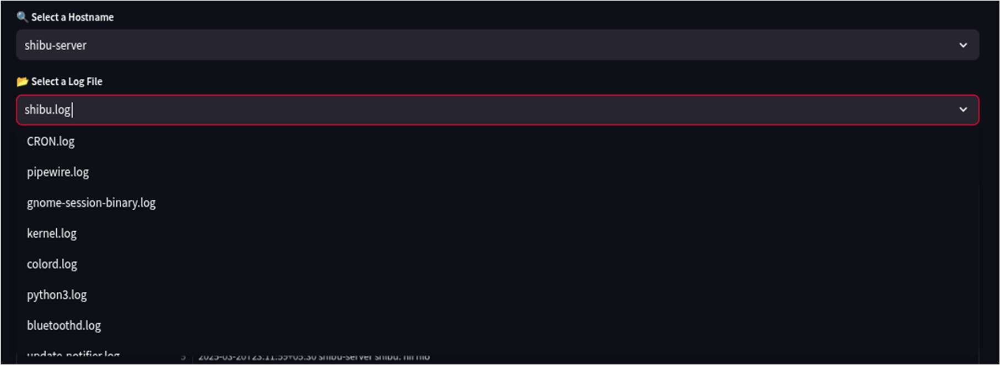
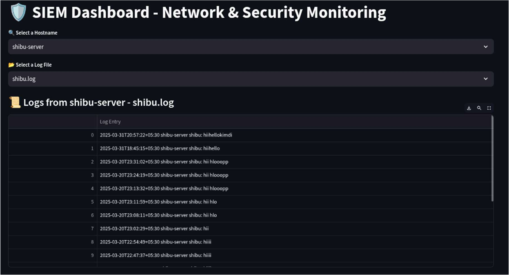
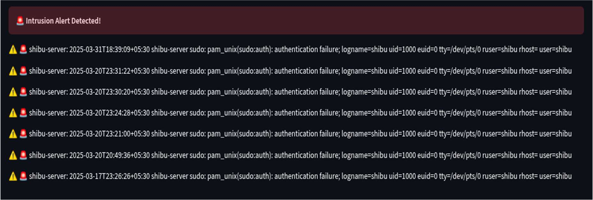

# 🛡️ SIEM Dashboard - Streamlit

A real-time, lightweight Security Information and Event Management (SIEM) dashboard built using Python and Streamlit.

It visualizes system usage, monitors client logs, and detects potential USB-based threats and intrusion attempts from logs like `auth.log`, `kernel.log`, etc.

---

## 📊 Features

- **Real-time Monitoring:** System resource tracking (CPU, RAM, Disk) and multi-host log visualization.
- **Physical Security:** Advanced USB insertion detection from kernel logs.
- **Alert Management:**
    - **Clear USB Alerts:** Dismiss alerts directly from the sidebar. Persistent across sessions/restarts via local JSON storage.
    - **Restore All:** One-click functionality to bring back all previously cleared USB alerts.
- **Administrative Tools:**
    - **Fix Permissions:** One-click utility to apply `chown syslog:adm` and `chmod 755` to `/var/log/remote_logs/`, ensuring smooth log ingestion for new clients.
- **Threat Detection:** Predefined patterns for intrusion detection.
- **Cross-Platform:** Supports both Linux log forwarding and Windows endpoint USB monitoring.
- **Interactive UI:** Dynamic Plotly charts with a clean, responsive Streamlit layout.

---

## ⚙️ System Configuration Guide

### 🖥️ Server Configuration (SIEM Dashboard Host)

1. **Enable `rsyslog` to receive logs:**

  ```bash
   $ sudo systemctl enable rsyslog
   ```
2. **Configure rsyslog to receive logs:**

   Open `/etc/rsyslog.conf` and ensure the following lines are uncommented:

   ```conf
   module(load="imudp")
   input(type="imudp" port="514")

   module(load="imtcp")
   input(type="imtcp" port="514")
   ```

3. **Create log directory for incoming logs:**

   ```bash
   $ sudo mkdir -p /var/log/remote_logs
   ```

4. **Configure template and storage for remote logs:**

   Add the following to the **end** of `/etc/rsyslog.conf`:

   ```conf
   template(name="RemoteLogs" type="string" string="/var/log/remote_logs/%HOSTNAME%/%PROGRAMNAME%.log")

   *.* ?RemoteLogs
   ```

5. **Restart `rsyslog`:**

   ```bash
   $ sudo systemctl restart rsyslog
   ```

### 💻 Client Configuration (Remote Monitored Systems)
  ### Linux Systems

1. **Edit the rsyslog config to forward selected logs:**

   Open `/etc/rsyslog.conf` and add the following to the end:

   ```conf
   *.* @@<SIEM_SERVER_IP>:514
   ```

   > 🔁 Replace `<SIEM_SERVER_IP>` with the actual IP address of your SIEM Dashboard host.

2. **Restart `rsyslog` on the client:**

   ```bash
   $ sudo systemctl restart rsyslog
   ```
   
  ### Windows Systems

  Since Windows lacks a native syslog forwarder, a custom Python-based Endpoint Agent is provided. This agent goes beyond standard log forwarding with **Active      Defense** — it monitors USB hardware states in real-time, triggers local physical alarms, and pipes structured event logs to your central dashboard.

  #### What the Windows Agent Provides

  * **Physical Hardware Alerts** — triggers an audible siren and a desktop notification whenever a USB drive is inserted
  * **Centralized Visibility** — forwards the event to the dashboard's `kernel.log` stream, making it instantly visible in the USB Alerts panel without any changes to the core dashboard code
  * **Zero-Config Integration** — uses a UDP-based log push; no Windows Event Forwarding (WEF) or third-party enterprise agents required

#### Setup

1. Navigate to the `windows/` directory
2. Open `usb_detector.py` and set `SIEM_SERVER_IP` to your Linux dashboard's IP address
3. Install dependencies:
```bash
  pip install -r windows/requirements.txt
```
4. Run the agent:
```bash
  python windows/usb_detector.py
```
#### Running at Startup

To have the agent start automatically when Windows boots, use **Task Scheduler**:

1. Open **Task Scheduler** → *Create Basic Task*
2. Set trigger to **When the computer starts**
3. Set action to **Start a program**
   - Program: `pythonw.exe` *(runs silently with no console window)*
   - Arguments: `C:\path\to\windows\usb_detector.py`
4. Under *Conditions*, uncheck **"Start the task only if the computer is on AC power"**
5. Save and test by restarting

> 💡 To find the path to `pythonw.exe`, run `where pythonw` in Command Prompt.

Alternatively, place a shortcut to the script in the **Startup folder**:
```bash
Win + R → shell:startup → paste shortcut of usb_detector.py
```
> ⚠️ This method opens a console window on boot. Use Task Scheduler with `pythonw.exe` for a silent background process.
  
## 🔐 Permissions & Access (Server-side)

Ensure that the user running the Streamlit app has read access to `/var/log/remote_logs/`:

```bash
$ sudo chown -R syslog:adm /var/log/remote_logs
$ sudo chmod -R 755 /var/log/remote_logs
```
---

## 🛠️ Installation (Server-side)

```bash
$ git clone https://github.com/Jobil-Libu/SIEM-Dashboard.git
$ cd SIEM-Dashboard
$ pip install -r requirements.txt
``` 

---

## 💻 Running (Server-side)

```bash
$ streamlit run siem.py
``` 

---


## 📸 Screenshots
> The dashboard shows system resource usage, USB activity, and intrusion alerts in real time.




> The drop down menu to select the client systems and log files



> Display log entries retrieved from the selected client and log file



> Intrusion Detection Alert in SIEM Dashboard


