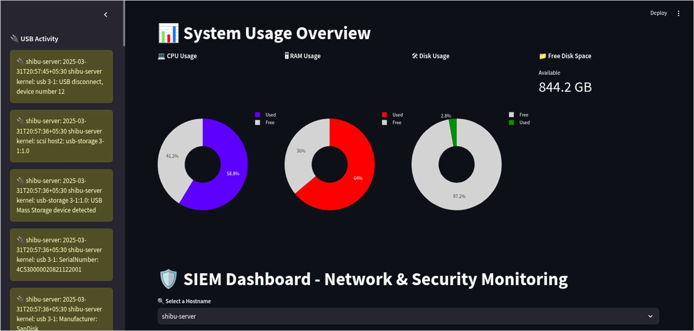
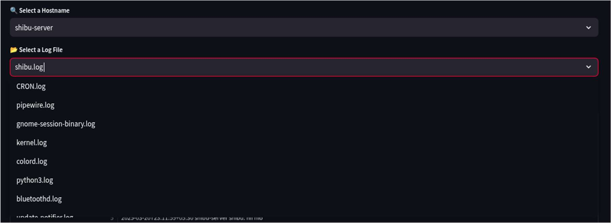
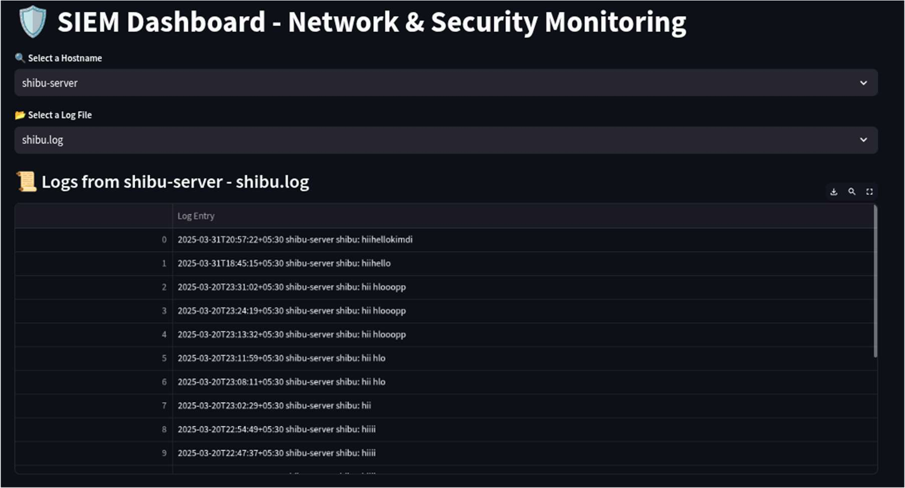
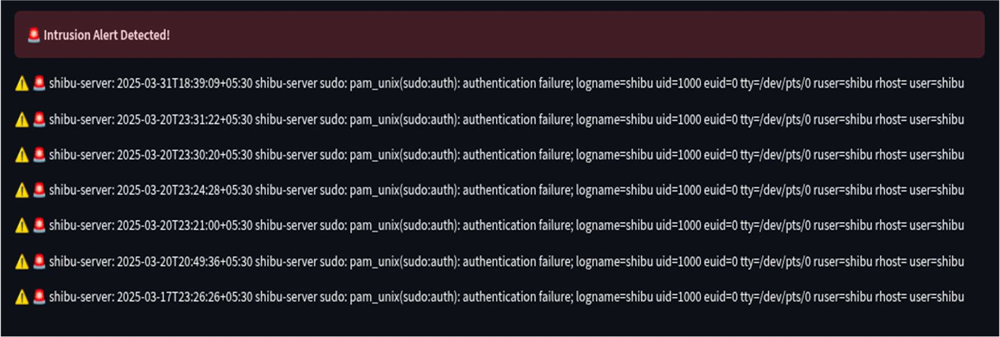

# 🛡️ SIEM Dashboard - Streamlit

A real-time, lightweight Security Information and Event Management (SIEM) dashboard built using Python and Streamlit.

It visualizes system usage, monitors client logs, and detects potential USB-based threats and intrusion attempts from logs like `auth.log`, `kernel.log`, etc.

---

## 📊 Features

- Real-time system monitoring (CPU, RAM, Disk)
- USB device detection from kernel logs
- Intrusion detection using predefined attack patterns
- Multi-host log monitoring from `/var/log/remote_logs/`
- Dynamic and interactive UI with Plotly charts
- Streamlit-based minimal and clean layout

---

## 🚀 Tech Stack

- Python 3
- Streamlit
- Pandas
- Plotly
- psutil
- Linux system logs (`/var/log/`)

---

## 🔧 Installation

```bash
git clone https://gitlab.com/yourusername/siem-dashboard-streamlit.git
cd siem-dashboard-streamlit
pip install -r requirements.txt
streamlit run siem_dashboard.py" 
``` 

---

## 📸 Screenshots
> The dashboard shows system resource usage, USB activity, and intrusion alerts in real time.


> The drop down menu to select the client systems and log files


> Display log entries retrieved from the selected client and log file


> Intrusion Detection Alert in SIEM Dashboard


---